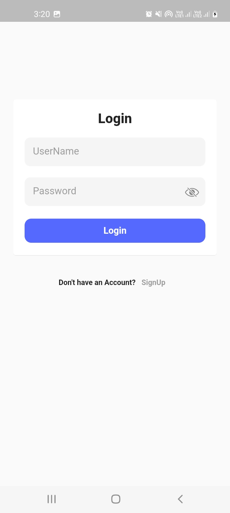
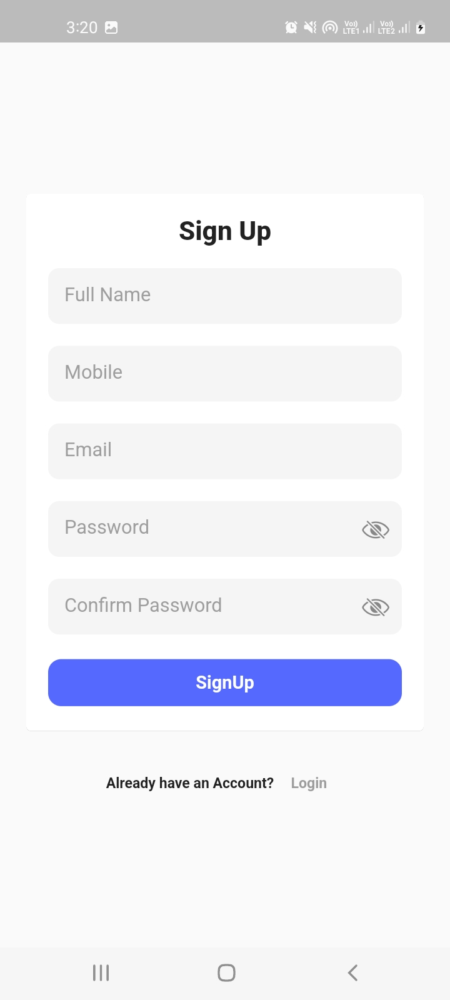
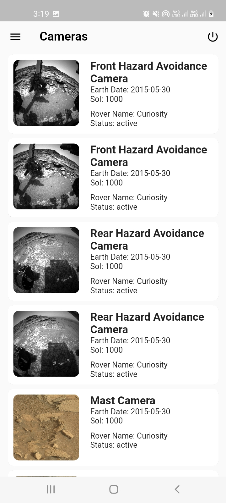
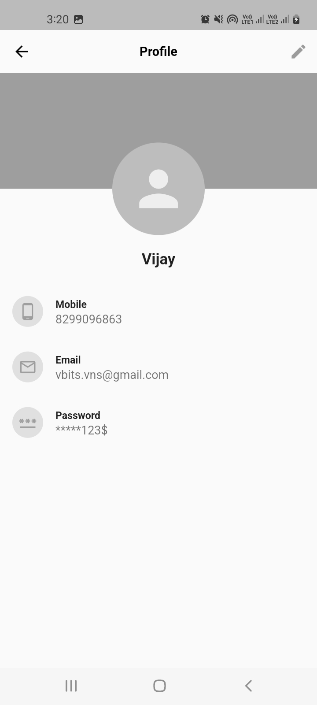
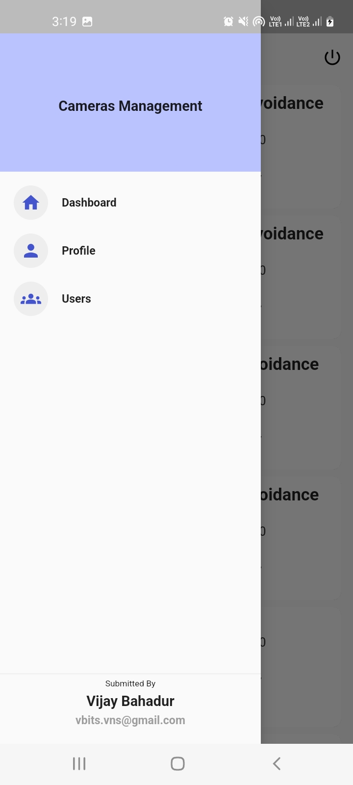

# assignment

A new Flutter project assignment with Local Storage 

## Getting Started

1- Login / Signup Page with local db, once signup same credentials use for login  

 
2- Once complete show a notification to user for signup

3- After login dashboard where need to show list and details using this api

https://api.nasa.gov/mars-photos/api/v1/rovers/curiosity/photos?sol=1000&api_key=DEMO_KEY
 

4- Profile page need to show detail of user  
 
5- All created user also needs to show inside app 

A few resources to get you started if this is your first Flutter project:

- [Lab: Write your first Flutter app](https://docs.flutter.dev/get-started/codelab)
- [Cookbook: Useful Flutter samples](https://docs.flutter.dev/cookbook)

For help getting started with Flutter development, view the
[online documentation](https://docs.flutter.dev/), which offers tutorials,
samples, guidance on mobile development, and a full API reference.
